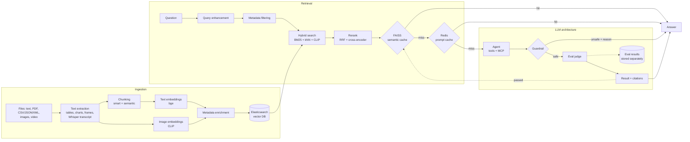

# AI-Powered Multimodal Search Engine

**Ask questions about a company's internal documents — text, PDFs, tables, charts, images and videos — and get
answers that cite the exact file, page or video timestamp they came from.**


A retrieval-augmented generation (RAG) system built end to end: an ingestion pipeline that understands many file
types, hybrid search with reranking, two cache layers, an agentic LLM with tools and MCP, a safety guardrail and an
automatic answer evaluator — containerized and shared privately over Tailscale.

---

## Demo

| Search page | Admin page |
|---|---|
|  |  |

*Users only ask questions; admins add documents. Each answer shows its sources, where it came from (LLM or a
cache), the tools the LLM used and its evaluation scores.*

---

## Features

- **Multimodal ingestion** — text, Markdown, PDF (text, tables, charts and images separated), CSV / JSON / XML,
  images, and video (speech transcribed with Whisper, frames sampled and embedded).
- **Smart + semantic chunking** — meaning-based splits for prose; tables, records and transcripts split along
  their own structure; chunks never cross a page or heading.
- **Hybrid search** — BM25 keyword search and dense vector search in one Elasticsearch query, plus CLIP
  text-to-image search, so a text question also finds charts, photos and video frames.
- **Reranking** — reciprocal rank fusion of the result lists, then a cross-encoder rereads every candidate.
- **Two cache layers** — a FAISS semantic cache (a similar question was answered before) and a Redis prompt
  cache (same or similar prompt with the same evidence); both invalidate automatically when documents change.
- **Agentic LLM** — the LLM can search again, read neighbouring passages, list files, do exact arithmetic and
  call MCP-server tools; every claim is cited as `[n]`.
- **Guardrail + evaluation** — a safety model blocks harmful content, leaked secrets, sensitive personal data and
  prompt injection; an LLM judge scores each answer for faithfulness, relevance and citation correctness. Only
  answers that pass are cached; every evaluation is stored separately and never ingested.
- **Two free LLM providers working together** — Groq and Gemini, each the automatic fallback of the other.
- **Private deployment** — Docker Compose for the whole stack; Tailscale publishes only the two pages over HTTPS,
  with user identity and an admin-only page, and nothing on the public internet.

---

## Architecture

The full design is in [`docs/Search_Engine_Architecture.drawio`](docs/Search_Engine_Architecture.drawio); the
code follows it box by box ([`Prompts/Build_order.md`](Prompts/Build_order.md) maps every box to a module).



**One question, step by step:** the question is rewritten to stand alone (using the session's history) and any
filters it mentions are extracted → hybrid search runs over text and images → results are fused and reranked →
the caches are checked → on a miss the agent answers from the numbered passages, calling tools if needed → the
guardrail checks the answer → the judge scores it → a passing answer is cached and returned with its citations.

---

## Tech stack

| Layer | Choice | Why |
|---|---|---|
| Vector database + keyword search | **Elasticsearch 8.15** via `langchain-elasticsearch` | BM25 and dense vectors in one store and one query |
| Orchestration | **LangChain 1.x**, **LangGraph** (`create_agent`) | retrievers, rank fusion, structured output, agent loop with middleware |
| Text embeddings | **BAAI/bge-small-en-v1.5** (384-d) | strong retrieval quality at a small size; runs on CPU |
| Image embeddings | **CLIP ViT-B/32** (512-d) | puts text and images in one space for text-to-image search |
| Reranker | **ms-marco-MiniLM-L6-v2** cross-encoder | matched a model 12× its size on the benchmark at a third of the latency |
| Speech to text | **faster-whisper** | accurate local transcription for video |
| PDF parsing | **PyMuPDF** | text, tables and vector charts separated per page |
| Caches | **FAISS** (semantic), **Redis Stack** (exact + vector similar prompt, sessions) | in-process speed for similar questions; shared, TTL-based prompt cache |
| LLMs | **Groq** (`gpt-oss-120b`, `gpt-oss-20b`, `gpt-oss-safeguard-20b`) + **Gemini 2.5 Flash** | free tiers; each job has a first choice and an automatic fallback; the judge runs on the other provider than the writer |
| Tools | LangChain tools + **MCP** (`langchain-mcp-adapters`) | local tools plus any MCP server's tools |
| API / UI | **FastAPI**, **Streamlit** | typed HTTP API; the UI talks to it only over HTTP |
| Packaging / deployment | **uv**, **Docker Compose**, **Tailscale** | locked dependencies, one-command stack, private HTTPS with identity |

---

## Getting started

**Prerequisites:** Docker Desktop, and free API keys from [Groq](https://console.groq.com) and/or
[Google AI Studio](https://aistudio.google.com) (one is enough; with both, each covers for the other).

```bash
git clone https://github.com/ArChIt690/AI-powered-search-engine-using-multi-modal-rag.git
cd AI-powered-search-engine-using-multi-modal-rag
cp .env.example .env          # then add GROQ_API_KEY and/or GEMINI_API_KEY
docker compose up -d --build
```

| Page | URL |
|---|---|
| Admin page (add documents) | http://localhost:8502 |
| Search page (ask questions) | http://localhost:8501 |
| API docs | http://localhost:8000/docs |

The first start builds the images and downloads the models (~1.5 GB, about 8 minutes); later starts take about a
minute. Your documents, indexes, caches and models are kept across `docker compose down` / `up`.

**Without Docker for the app** (development): install [uv](https://docs.astral.sh/uv/), run `uv sync`, then
`docker compose up -d elasticsearch redis`, `uv run uvicorn search_engine.api.app:app`,
`uv run streamlit run frontend/app.py` and `uv run streamlit run frontend/admin.py --server.port 8502`.

---

## Usage

**In the browser:** add files on the admin page, then ask on the search page, e.g. *"What is the total revenue of
all four regions, and what share came from the East?"* — the agent uses its calculator and answers
*"436 … about 32.8 % [1]"*, citing the PDF table. Ask a follow-up like *"and which region had the lowest?"*: it is
rewritten from the conversation and answered on its own.

**Command line:**

```bash
uv run search-engine ingest path/to/file-or-folder
uv run search-engine search "What was the revenue of the East region?" --session s1 --file-type pdf
```

**API:**

```bash
curl -X POST localhost:8000/search -H "Content-Type: application/json" \
     -d '{"query": "How long should the sponge cake bake?", "session_id": "s1"}'
curl -X POST localhost:8000/ingest -F files=@report.pdf -F files=@notes.md
curl localhost:8000/files
```

The search response carries the answer, numbered citations (file, page or video time, snippet), where the answer
came from (`llm`, `faiss_semantic_cache`, `redis_prompt_cache`, `guardrail_blocked`), the eval scores and the
tools used.

---

## Configuration

All settings live in `.env` (see [`.env.example`](.env.example)); defaults are in
[`src/search_engine/core/config.py`](src/search_engine/core/config.py).

| Variable | Purpose | Default |
|---|---|---|
| `GROQ_API_KEY`, `GEMINI_API_KEY` | LLM providers (one or both) | — |
| `GROQ_MODEL`, `GROQ_FAST_MODEL`, `GEMINI_MODEL` | answer model, fast model (query rewrite, judge fallback), Gemini model | `openai/gpt-oss-120b`, `openai/gpt-oss-20b`, `gemini-2.5-flash` |
| `TOP_K` | passages given to the LLM | `10` |
| `SEMANTIC_CACHE_THRESHOLD` | cosine similarity for a FAISS cache hit | `0.92` |
| `EVAL_PASS_SCORE` | minimum judge score (1–5) for an answer to be cached | `4` |
| `AGENT_MAX_TOOL_CALLS` | tool calls the agent may make per question | `4` |
| `MCP_SERVERS` | MCP servers the agent may use (JSON) | none |
| `TS_AUTHKEY`, `SEARCH_ADMINS` | Tailscale auth key; logins allowed on the admin page | — |

---

## Deployment: private HTTPS over Tailscale

Built as an internal company tool, so nothing is on the public internet:

- Every host port is bound to `127.0.0.1`; the databases and the API are never reachable from the network.
- A **Tailscale sidecar container** joins the tailnet as its own machine, `search`, and uses `tailscale serve`
  as an HTTPS reverse proxy with an automatic certificate: the search page on `:443`, the admin page on `:8443`,
  Funnel off.
- Tailscale passes the signed-in user's identity (`Tailscale-User-Login`), so there is no login system to build:
  the admin page admits only `SEARCH_ADMINS`. An optional access policy
  ([`tailscale/policy.example.hujson`](tailscale/policy.example.hujson)) adds a network-level lock on the admin
  port.

```bash
# .env: TS_AUTHKEY=tskey-auth-...   SEARCH_ADMINS=you@example.com
docker compose --profile tailscale up -d --build      # -> https://search.<your-tailnet>.ts.net
```

To give someone access, share the `search` machine from the Tailscale admin console; they see only that machine.

---

## Project structure

```
src/search_engine/
├── ingestion/     sources/ (one loader per file type), chunking, text + image embeddings, enrichment, vector store
├── retrieval/     query enhancement, filters, hybrid search, rerank, FAISS + Redis caches, sessions, pipeline
├── llm/           agent, tools/, MCP client, guardrail, eval, eval store, pipeline
├── api/           FastAPI app: /search, /ingest, /files, /health
├── infra/         clients built once: Elasticsearch, Redis, models, LLMs (two providers with fallback)
├── schemas/       typed models shared by all parts
└── cli.py         search-engine ingest | search
frontend/          Streamlit search page, admin page, HTTP client
eval/              retrieval benchmark: corpus, 25 questions, recall@k / MRR runner
tests/             unit, integration (real Elasticsearch + Redis) and end-to-end tests
tailscale/         serve config and example access policy
docs/              architecture diagram
Prompts/           build order and the design plan of each part
```

---

## Testing and evaluation

```bash
uv run pytest                               # ~250 unit + integration tests
uv run pytest -m slow tests/unit            # with the real models
uv run pytest -m "slow and integration"     # end-to-end: one "done when" test per part of the architecture
uv run python -m eval.run                   # retrieval benchmark (no LLM calls)
```

The end-to-end tests run real models, Elasticsearch, Redis and an MCP server with scripted LLM replies, so they are
repeatable and spend no API quota.

**Retrieval benchmark** (25 questions over text, records, tables and images):

| Stage | recall@1 | recall@5 | recall@10 | MRR@10 |
|---|---|---|---|---|
| Text hybrid search | 0.84 | 0.88 | 0.88 | 0.860 |
| + image search, rank fusion | 0.84 | **1.00** | 1.00 | **0.903** |
| + cross-encoder (MiniLM-L6) | 0.84 | 0.88 | 1.00 | 0.873 |

**Measured on a 16 GB laptop (CPU only):**

| | |
|---|---|
| New question (query rewrite, search, rerank, agent, guardrail, eval) | ~7–15 s |
| Repeat or similar question (FAISS cache) | ~1.6–5 s |
| Ingest 9 mixed files → 79 chunks (in Docker) | 7 s |
| Guardrail check / eval judge | ~0.3 s / ~2.5 s |

---

## Design decisions and limitations

- **Rank fusion runs in LangChain, not Elasticsearch.** Elasticsearch's own RRF needs a paid license (it returns
  403 on the free one), so LangChain's built-in hybrid search runs with `rrf=False` and `EnsembleRetriever` does
  the fusion.
- **Images are placed after text in the final ranking.** CLIP's text-to-image scores barely separate matching from
  unrelated pictures (0.637 for the matching chart vs 0.645 for an unrelated query), so no score cut-off works;
  images get at most two slots unless only pictures were asked for.
- **A small reranker beat a big one here.** `bge-reranker-base` scored lower on the benchmark, took 3.3 s per
  question and 1.4 GB of RAM; MiniLM-L6 took 0.95 s and ~0.1 GB.
- **The judge sees tool results.** A correct file list from the `list_files` tool first scored 2/2/1 because the
  judge saw only the passages; tool outputs are now passed to it as evidence.
- **Redis uses an append-only file.** Its default snapshots lost the cache and sessions on a restart.
- **Eval results never enter the corpus,** so earlier LLM answers can't come back as evidence for new ones.
- **Limitation — data leaves the machine.** Questions send matching passages to Groq / Gemini. Free tiers may use
  inputs to improve their models; a real deployment would use paid no-training tiers or a local model.
- **Limitation — free rate limits.** Gemini's free tier allows 5 requests a minute and a new question makes about
  four LLM calls, so heavy concurrent use needs paid tiers.
- **Limitation — pictures are known only by their label.** The LLM sees "chart from report.pdf, page 2", not the
  pixels; a vision model or generated captions would improve image answers.

---

## Roadmap

- Image captions at ingestion, so pictures can be reranked and described like text
- Per-group document permissions (using the Tailscale identity already passed to the pages)
- Deleting and re-indexing documents from the admin page
- A local LLM option (e.g. Ollama) for fully offline use
- Streaming answers in the UI

---

## License

Released under the MIT License — see [`LICENSE`](LICENSE).

## Author

**Archit Chakraborty** — [GitHub @ArChIt690](https://github.com/ArChIt690)
